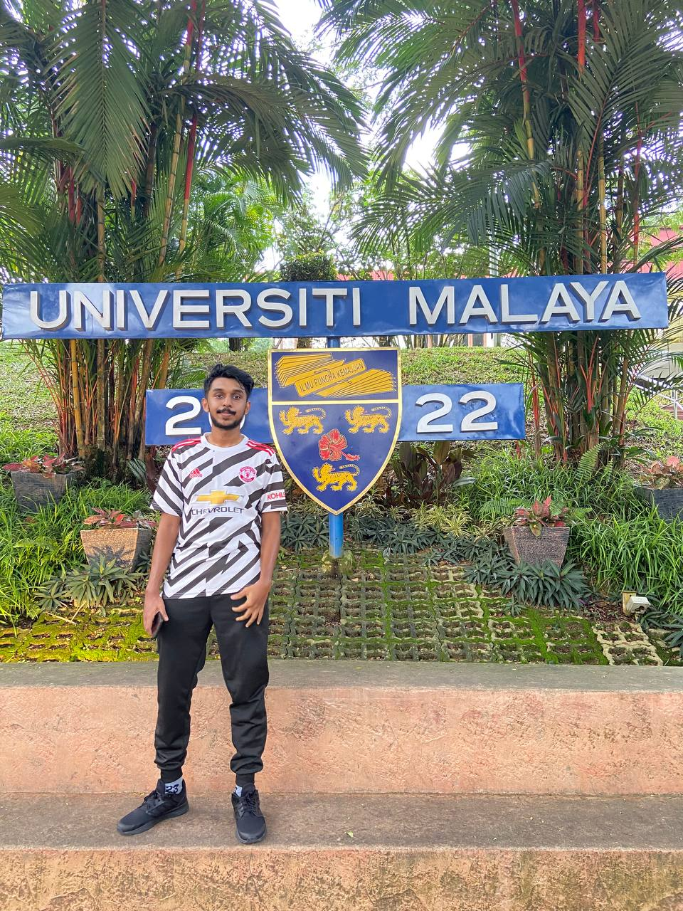

# Introduction

Hi!I’m Sarrwin Ramachandaran, a Software Engineering student currently enrolled in the Software Maintenance and Evolution course (WIF3005). I’m genuinely excited about this subject because I understand how crucial it is to ensure that software remains functional, adaptable, and efficient over time. Through this course, I’m eager to develop hands-on skills that will not only enhance my current projects but also serve as a solid foundation for my future career in software engineering.

- **Fun fact**: I love watching movies during my free time.
- **Course expectations**: I expect this course can help me to gain and develop knowledge and skills in maintaining and evolving software, which will be valuable in handling real-world software projects. I also hope to learn effective techniques for software maintenance, understanding how to manage technical debt, perform refactoring, and ensure software scalability and reliability. These skills will assist me in future professional roles, particularly in sustaining long-term software projects, adapting to changing requirements, and contributing to the continuous improvement of systems.  .

# GitHub Profile
<h3 align="left">You can view my personalized GitHub profile <h3>  https://github.com/sarrwin </h3>  
